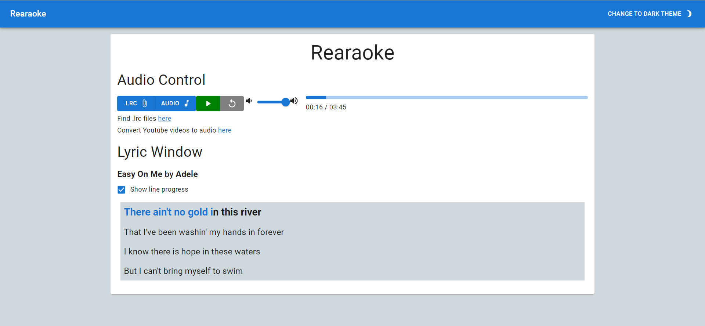

[](https://app.circleci.com/pipelines/github/nmarklund10/Rearaoke?filter=all)

# Rearaoke

[Live Website](https://rearaoke-d39ee58f8591.herokuapp.com/)

This is a karaoke web application that lets you upload a [.lrc file](https://en.wikipedia.org/wiki/LRC_(file_format)) and an audio file.  Once the user presses play, the lyrics will be synchronously displayed on the screen to sing along to!



## Dev Setup
### Docker
```
docker compose build
docker compose up
```

### Install dependencies
```
yarn
```
### Run Development Mode
```
yarn dev
```
### Create Production Build
```
yarn build
```
### Run Production Mode
#### On private machine
```
yarn preview
```
#### On public machine
```
yarn start
```
